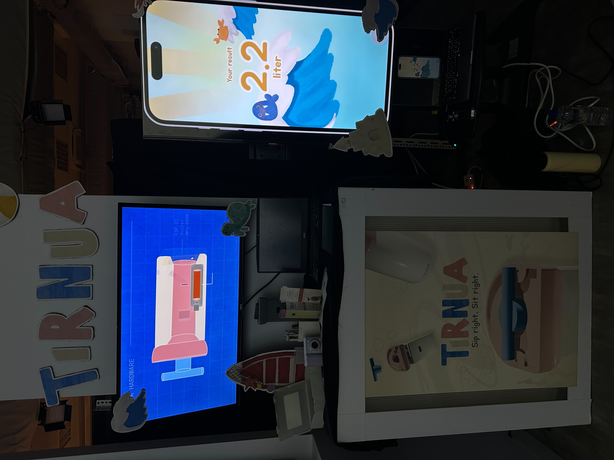
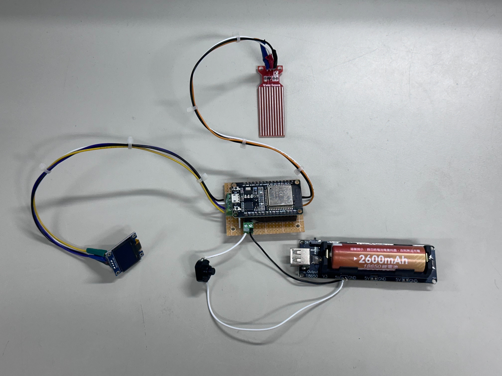

# Tirnua Smart Water Bottle

A smart water bottle that helps with your drinking posture

| Group Members | ID |
| --- | --- |
| 陳麗慧 | 112AT0006 |
| 徐梅玲 | 112AT0010 |
| 黃子奇 | 114998411 |

> Final project for **Creative Design** class

## Features

| Feature | Description |
| --- | --- |
| Water level notification | Once the water level gets low enough, the bottle will warn the user to refill |
| Drinking posture check | Checks the user's drinking posture using the accelerometer as they drink. Once the time limit is hit, the buzzer will signal to the user to return the bottle to its resting position |

## Hardware 

| Hardware | Description |
| --- | --- |
| ESP32 | System microcontroller |
| 2600 mAh 18650 battery | System battery |
| SEN18 | Water level sensor |
| 0.96" OLED Screen | For displaying information and animations |
| Switch button | Button for turning device on and off |
| MPU6050 Accelerometer | Tilt sensor |
| Buzzer | Makes noise after successful posture check |

## Images

> Project display
> 

> Electronic components
> 

> Inside the bottle
> 
> 